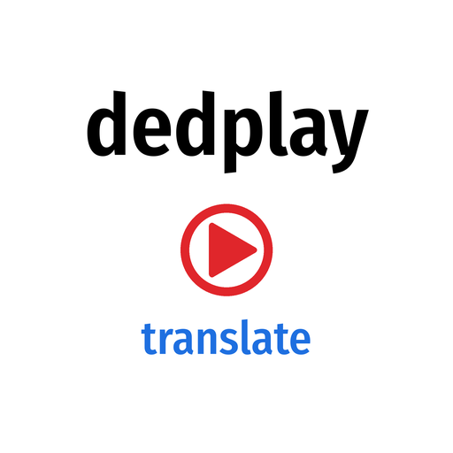

# Dedplay Translate



Arapça, İngilizce ve Fransızca kitapları Türkçeye çeviren, tamamen yerelde çalışan uygulama.
Çeviri, Ollama üzerinde çalışan Gemma 3 12B modeliyle yapılır. Ücretsizdir; kitaplar sunucudan dışarı çıkmaz.

## Özellikler

- Girdi: EPUB, PDF, DOCX, TXT, PNG, JPEG (taranmış PDF ve resimler Tesseract OCR ile okunur)
- Çıktı: EPUB, Word, PDF, HTML, TXT; hepsi isteğe bağlı iki dilli (aslı + Türkçesi)
- Sayfa numaraları ve tekrar eden üst/alt bilgiler temizlenir, bölünen paragraflar birleştirilir
- Terim sözlüğü (dini kalıplar ve terimler her zaman belirlenen karşılıkla çevrilir)
- Her paragraf anında kaydedilir; yeniden başlatmada kaldığı yerden devam eder
- Çeviri sürerken örnek çeviri görüntüleme ve kısmi indirme

## Kurulum 1: Docker Hub'dan (önerilen)

```bash
mkdir -p /DATA/dedplay-translate && cd /DATA/dedplay-translate
curl -L -o docker-compose.yml https://raw.githubusercontent.com/berzahbey/dedplay-translate/main/docker-compose.hub.yml
docker compose up -d
```

ZimaOS / CasaOS: Uygulama mağazasında "Özel kurulum > İçe aktar" ile `docker-compose.hub.yml` dosyasının içeriğini yapıştırın.

## Kurulum 2: Kaynak koddan

```bash
git clone https://github.com/berzahbey/dedplay-translate.git /DATA/dedplay-translate
cd /DATA/dedplay-translate
docker compose up -d --build
```

Adres: `http://<sunucu-ip>:8060`

İlk açılışta model (~8 GB) indirilir; arayüzdeki durum satırı "Hazır" olunca çeviri başlar.
Veriler `/DATA/AppData/dedplay-translate/` altında tutulur.

## Ayarlar

`docker-compose.yml` içindeki ortam değişkenleri:

- `LLM_MODEL`: `gemma3:12b` (varsayılan), `aya-expanse:8b` (daha hızlı), `gemma3:27b` (daha kaliteli, 2-3 kat yavaş)
- `LLM_CTX`: bağlam uzunluğu (varsayılan 4096)
- `LLM_THREADS`: işlemci iş parçacığı sayısı (boşsa otomatik)

## Donanım

En az 16 GB RAM önerilir (32 GB rahat). i7-13700H üzerinde 400 sayfalık bir kitap yaklaşık 8-14 saat sürer.
